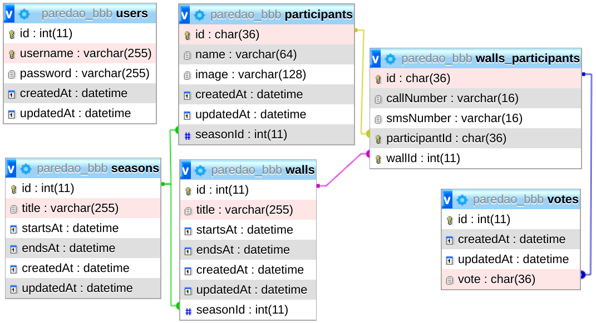

# Comments

## Ambiente de desenvolvimento:
- Sistema
  - Sistema Operacional: [Arch Linux](https://www.archlinux.org/)
  - Kernel: Linux 5.4.8-arch1-1
  - Arquitetura: x86-64
- Software
  - [NodeJS](https://nodejs.org/) 13.6.0
  - [MariaDB](https://mariadb.org/) 15.1
  - [Yarn](https://yarnpkg.com/) 1.21.1
- Frameworks
  - [Next.js](https://nextjs.org/) - Front-end
    - [D3.js](https://d3js.org/) - gráficos
    - [Material-UI](https://material-ui.com/) - dashboard de administração
  - [Feathers](https://feathersjs.com/)
    - [Sequelize](https://sequelize.org/)

## Rodando manualmente, localmente

1. Instalar dependencias
  - [NodeJS](https://nodejs.org/) 13
  - [MariaDB](https://mariadb.org/) 15
  - [Yarn](https://yarnpkg.com/) 1.21
2. Criar banco de dados e usuário no MariaDB
  - Banco: paredao_bbb
  - Usuário: paredao_bbb
  - Senha: p4r3d40_bbb_aleuck!
3. Fazer build:
  - Nos diretórios `be/` e `fe/`, rodar o comando: `yarn`
  - No diretório `fe/`, rodar o comando `yarn build`
4. Iniciar a aplicação:
  - Nos diretórios `be/` e `fe/`, rodar o comando: `yarn start`
  - Acessar http://localhost:3000/

## Deploy local com Docker

*Todos os comandos devem ser executados na raís do projeto (repositório).*

**Instalar o Docker** (apenas no ubuntu):
```sh
./configure.sh
```

**Iniciar** os containers (também cria as imagens, containers e rede no docker se necessário):
```sh
make run
```

**Acessar** a *aplicação*:
  - Votação: http://localhost:3000/ 
  - Painel de administração: http://localhost:3000/admin
    - Usuário: admin
    - Senha: selecaoglobo

**Parar** os *containers*:
```sh
make stop
```

**Remover** os *containers* e as *imagens* do docker:
```sh
make rm-all
```

Outros comandos:
```sh

# Start containers individually
make start-db
make start-be
make start-fe

# Stop containers individually
make stop-db
make stop-be
make stop-fe

# Create images individually
make create-img-db
make create-img-be
make create-img-fe

# Remove images individually
make rm-img-db
make rm-img-be
make rm-img-fe

# Create containers individually
make create-container-db
make create-container-be
make create-container-fe

# Remove containers individually
make rm-container-db
make rm-container-be
make rm-container-fe

# Creates all docker images
make create-imgs

# Remove all docker images
make rm-imgs

# Create all containers
make create-containers

# Remove all containers
make rm-containers

# Remove specific container and respective image
make rm-db
make rm-be
make rm-fe

# Create or remove the docker network used
make create-network
make rm-network
```

*Obs.: Não estou montando a pasta de dados do MariaDB. Não há persistência de dados entre containers diferentes.*


## Front-end

Utilizei o *Next.js* para aprender mais sobre a ferramenta, e também pela facilidade de realizar renderização por backend.

Optei por renderização estática ao invés de utilizar *getInitialProps*, pois isto atrazaria o *first paint*, diminuindo a percepção de performance. Prefiro diminuir o tempo de tela branca.


### Testes:

Para testes unitários no front-end, optei pelo [*Mocha*](https://mochajs.org/) com asserções do [*Chai*](https://www.chaijs.com/), pois já tenho alguma familiariedade com eles.

Nunca havia usado essas feramentas com *React*. Foi um pequeno desafio configurar.

Não tive tempo para dar muita atenção aos testes. Se tivesse mais tempo, escreveria testes para cada componente.


### Componentes

Todos os componentes ficam no diretório `fe/components`

Procurei utilizar as propriedades *aria-label*, *role* etc. assim como estilização diferenciada para *:focus* em componentes intergíveis para atingir um nível mínimo de acessibilidade.

Faltou componentização dos elementos do Dashboard (telas de gerência). Parte disso se deve ao tempo, e outra parte por ter decidido passar o objeto cliente para os componentes através de *props* ao invés de usar *Redux* ou um *ContextProvider* (o que se demonstrou um erro).


#### Button

Procurei fazer um botão com a aparência mais próxima possível do botão mostrado na imagem de referência, utilizando apenas recursos de estilos (CSS).


#### Dashboard

Painel de gerência. Onde os organizadores do BBB podem cadastrar as temporadas, os participantes, os paredões e conferir os resultados. Acessível na rota `/admin`.


#### DonutChart

Gráfico usado para mostrar os resultados após o voto. Feito com D3.js.

Com mais tempo, faria com que tivesse uma animação na atualização dos dados.


#### Feathers

Dois componentes, **FeathersClient** e **FeathersAuth**. Utilizam a técnica *render props* para passar adiante o objeto do cliente Feathers e para gerenciar o estado da sessão (login).

Obs.: Teria sido melhor se eu tivesse utilizado um *ContextProvider* ou *Redux* para isso.


#### Icons

Componentes de icones utilizados. Não foi a melhor implementação para um sistema de icones, mas serviu este propósito.


#### Layouts

Componentes que definem a estrutura e aparência básica do site.


#### Login

Apenas um formulário de login. Utilizado para a autênticação da página de gerência `/admin`.


#### Modal

Conjuntos de componentes para desenhar um modal igual ao do exeplo dado como referência.


#### ParticipantPicture

A partir dos dados de um participante, baixa a sua respectiva imagem e renderiza um elemento *img*, colocando o nome do participante na propriedade *alt* da imagem.


#### Selectable

Faz um conteúdo se tornar selecionável (como um *checkbox* ou *radio*).
Tive o cuidado para que seja acessivel usando também o teclado, e que o *:focus* seja visualmente percebido.


#### SelectableParticipant

União dos componentes **ParticipantPicture** e **Selectable**.


#### ParticipantsSelect

Renderiza um conjunto de **SelectableParticipant**s com comportamento de *radio button*. Pode ser selecionado utilizando o teclado (tab para selecionar e setas para alterar a seleçao).

#### VotingModal

Modal que contém a interface de votação e resultados, cada qual em um sub-componente.

Quando a tela de resultados está aberta, é realizado pooling dos resultados da votação a cada 15 segundos.

No banco de dados os votos são acumulados em memória antes de serem inseridos no banco de dados (para melhorar a performance de inserção).

Assim demora no máximo uns 10 segundos para o voto ser gravado no banco de dados, e 15 segundos para refletir na tela.

Como o volume de votos é grande isso não vai impactar muito a experiência. Um único voto não terá muito impacto na proporção total.


### Estilos

A fonte na imagem de exemplo que forneceram parece ser a "ProximaNova" que é utilizada bastante pela Globo.com. Porém como a fonte não é gratuíta, resolvi usar a Raleway, da Google, que é relativamente semelhante.

Adicionei autoprefixer ao sistema de build para facilitar compatibilidade com outros navegadores (IE, Safari etc.).

Optei pelo uso de *CSS Modules* para que as classes fiquem com escopo local por arquivo.

Para poder reutilizar componentes com diferentes estilos, criei um *ThemeContext* para prover as classes.


## Back End

### Banco de dados
Optei por utilizar o MariaDB. Pensei em usar Mongo ou outra solução não relacional. Porém preferi modelar de forma relacional.

#### Estrutura do banco de dados


### Performance

#### Votos

Realizar um insert imediatamente ao receber cada voto não alcancaria uma boa performance, principalmente por conta da atualização dos índices.

Optei por acumular os votos em memória e salvar eles no banco em lotes, a cada 10 segundos os votos acumulados são inseridos no banco de dados.

Com um único processo (e JavaScript não tem threads) consegui perto dos 1000 votos por segundo (sem a validação de captcha).

Não fui capaz de testar a performance incluindo o teste de captcha.

Acredito ser possível atingir a performance desejada com pelo menos duas (ou três) instâncias do servidor de back-end e um balanceador de carga.

#### Demais requisições

Para atender as requisições de imagens dos participantes e dos dados do paredão, sem comprometer a performance do(s) servidor(es) back-end, seria interessante instalar um cache (*Redis* etc) com tempo de vida generoso para as imagens (dos participantes), e de alguns segundos para dados do paredão (número de votos, etc).


## Transporte (comunicação cliente/servidor)

Para usuários comuns, na página de votação. A comunicação com o servidor será por HTTP(S) (REST). Utilizar transporte baseado em conexão (websockets) seria muito custoso (número muito grande de conexões).

Para usuários do *Dashboard Adminsitrativo*. Utilizei *web-sockets*. Assim, fica mais simples atualizar os dados em tempo real. Porém isso dificulta a utilização do [`cluster`](https://nodejs.org/api/cluster.html) do NodeJS, pois com vários processos na mesma máquina dividindo a mesma porta, não é possível garantir que o mesmo processo que realizou o *handshake* inicial receberia o segundo passo para estabelecer a conexão web-socket. Acredito que seria melhor trocar para REST, o que eu faria se tivesse mais tempo.


## Dificuldades

Minha experiência com ReactJS é limitada, e eu nunca havia trabalhado com Next.js (apenas feito o tutorial).

FeathersJS eu só tinha usado antes em um projeto pessoal inacabado.

Nunca havia criado uma rede no docker antes. Com isso, tive dificuldades com o docker do MariaDB pois o serviço demora um pouco para iniciar, e eu acabava iniciando o container do back-end antes do serviço do mariadb estar pronto. Usei um script de workaround para esperar o serviço subir antes de continuar.

## Lista de algumas coisas que deixei de fazer por falta de tempo

  - Resultados e estatísticas dos paredões no painel de administração;
  - Transição mais suave entre a tela de votar e a tela de resultados;
  - Animação do gráfico ao atualizar os resultados;
  - Tratar erros em vários lugares;
  - Desenvolver testes;
  - Barra de progresso ao fazer upload de imagem de participante;
  - Tela para editar as informações (título e datas) de uma temporada;
  - Migrar de socket.io para REST no painel de adminstraçao (para poder ter mais de um processo na mesma máquina no back-end);
  - Interface mais responsiva;
  - Revisar melhor este arquivo;
  - Dar mais atenção para meu parceiro;
  - Passar mais tempo com a família e amigos; e
  - Dormir mais.
